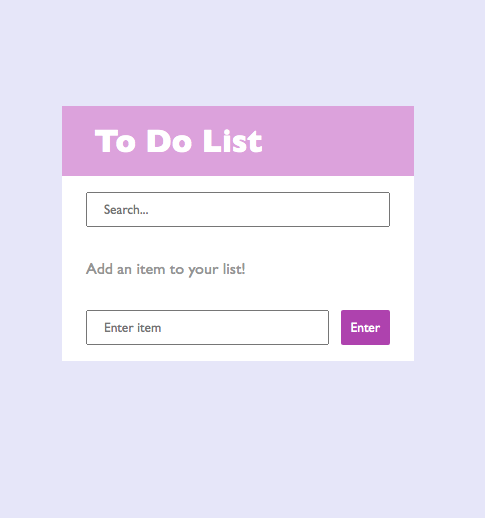
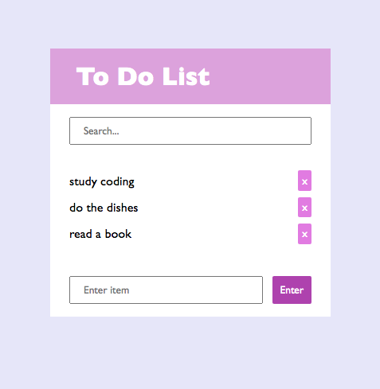

<h1 align="center">
   ✔︎ <a href="#"> TO DO LIST </a>
</h1>

<h3 align="center">
    To do list project!
</h3>

<h4 align="center"> 
	 Status: Finished
</h4>

 <a href="#about">About</a> •
 <a href="#features">Features</a> •
 <a href="#layout">Layout</a> • 
 <a href="#built-with">Built with</a> • 
 <a href="#author">Author</a>

## About

This is a todo list project based on Andrei Neagoie's ZTM course. 
For this project, it was used HTML, CSS and JavaScript.

Link: https://naomy19.github.io/to-do-list/

---

## Features

- [x] Add items to the list by clicking the button or with enter key;
- [x] Delete items by clicking the 'x' button;
- [x] Search items through the search bar.

---

## Layout

  
  

---

## Built with

The following tools were used in the construction of the project:

-   Editor:  **[Visual Studio Code](https://code.visualstudio.com/)**
-   Fonts:  Gill Sans

---

## Author

<a href="https://github.com/naomy19">
 
  
 <b>Camilla Naomy Tsuda</b></a> 
  

 

